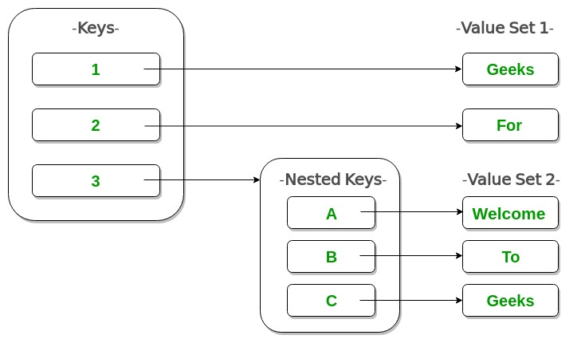

# Week 03 Day 2
✓ for cc's/assignments refer Priyesh's repository -- [here](https://github.com/never2average/AttainU-CCs)

✓ lecture slide -- [here](https://docs.google.com/presentation/d/18_uZozcZiaUfDHWiYU94b4TH9aP7YEHtK-P2iExzo6g/edit?usp=sharing)

## dictionary 
- key value pairs that are enclosed in {} and stored in an unordered way    
    ```python
    # Creating a Dictionary  
    Dict = {1: 'Geeks', 2: 'For', 3: 'Geeks'} 
    
    # to print the dictionary
    print(Dict)
    ```
- dictionary is printed/stored in an *unordered* fashion
- key --> hashing function -> hash refers to memory location
- value --> stored in that memory location

## hashing function
- hashing()
    ```python
    def hashing_function(string):
        # list comprehension
        return sum([ord(i) for in string])
    ```
- ord function is used to return ascii value for a character
- printing memory locations, to check unordered nature of a dictionary
- we can have nested keys too
    
- hashing function?

### list comprehension
- example
    - print all the numbers even in till 100
        ```python
        for i in range (0, 101, 2):
            print(i)
        ```
    - using list comprehension
        ```python
            print([i for in in range(0, 101, 2)])     
        ```

- if condition is list comprehension
    ```python
        print[i for i in range(0, 101) if i%2==0]
    ```

## dictionary methods
1. **how to add new key-value pair to dictionary**
    ```python
        d["key-add"] = "value-add"
    ```
    - if key to which we are trying to add value exists, the value is overwritten, replaces old value
    - what if we have two dictionaries, how do we concatenate? note that math operators doesn't work on dictionaries
        - use dict.update(new_dict)

2. **delete value from dictionary?**
    - del keyword is used 
        ```python
        del dict["key-name"]
        ```

3. **find the length or number of keys in dictionary?**
    - we can use the len method, len(d)
        ```python
        print(len(d))
        ```
    - gives number of keys in a dictionary as output

4. **clear()** 
    - clear method empties the dictionary provided as argument

5. **get()**
    - get method
        ```python 
        print(num_occ.get("rahul", "unable to found"))
        ```
    - this returns a value 

6. **keys method**
    - returns list of all the keys
        ```python
            print(dict1.keys())   
        ```

7. **return values**
    - use values()
        ```python
        print(dict1.values())
        ```

8. **items method**
    - items() prints key value pair
        ```python
            print(dict1.items())    
        ```
    - [ ] look up zip function 


## types of functions (math)
1. linear function
2. log function
3. quadratic function
4. polynomial function
5. exponential function

## time and space complexity
- cpu efficiency and ram efficiency are 2 most important metrics that can be used to judge a program
    - how to measure them?
        1. hardware is different
        2. it is handling loads at different times
    - so we check an algorithm for efficiency in both best, worst case

- define time complexity (refers to processing constraints)
    > Time complexity of an algorithm quantifies the amount of time taken by an algorithm to run as a function of the length of the input. 

- define space complexity (refers to ram constraints)
    > Space complexity of an algorithm quantifies the amount of space or memory taken by an algorithm to run as a function of the length of the input.
- fibonacci series
    ```python
    fib_list = [1, 1]
    for i in range(20):
        fib_list.append(fib_list[-1] + fib_list[-2])
    print(fib_list)
    ```
- another code to print fibonacci series
    ```python
    a, b = 1, 1
    print(a)
    print(b)
    for i in range(20):
        c = a + b
        print(c)
        a, b = b, c
    ```
- which method from above two example is more efficient?
    - later one has 3 variable, in all the cases, unlike the first one

### big-o notation
- we denote time-space complexity using notation
- definition
    > Big O notation defines an upper bound of an algorithm, it bounds a function only from above

*** 