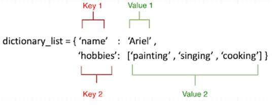
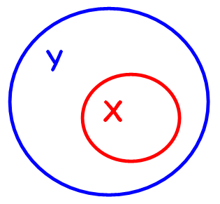

# week03-day1

Instructor — Priyesh S.

Recored lecture — https://drive.google.com/file/d/1Tzg13sN51FDPM86WFNveeMlsrXMfMb_K/view?usp=sharing 

# Today:

1. list()
2. range()
3. join()
4. find()
5. strip()
6. map()
7. question
8. dictionary ⭐️
9. dictionary methods
10. time complexity analysis ⭐️

# Functions on list:

## 1. list()

- the list method

    > list () takes a sequence and converts it to a list

        a = "this"
        print(list(a))
        
        # output
        # ['t', 'h', 'i', 's']

## 2. range()

- the range

    > returns a sequence of numbers, starting from 0 by default, and increments by 1 (by default), and ends at a specified number

        list(range(10))

## 3. join()

- join() method

    > join() method is a string method and returns a string in which the elements of sequence have been joined by str separator

        str_ex = "hello world"
        print(" ".join(str_ex))
        
        # output
        # h e l l o w o r l d

- example 2

        L = []
        for i in range(10):
        	L.append(str(i))
        print(L)
        print(" ". join(L))

- where is join used?
    
    - in hacker rank alphabet rangoli albeit ineffectively

## 4. find()

- find mind ()

    > return the left index of first occurrence of a substring in a string

- shows first occurrence's index, it is case sensitive

        txt = "Hello, welcome to my world."
        
        x = txt.find("welcome")
        
        print(x)

- this is a string method only
- how to find second occurrence of a substring?

## 5. strip()

- what is a superset? here y is super set of x

    [https://www.youtube.com/watch?v=1wsF9GpGd00](https://www.youtube.com/watch?v=1wsF9GpGd00)

    

    - strict subset?
- strip method

    > strip() is an inbuilt function in Python programming language that returns a copy of the string with both leading and trailing characters removed (based on the string argument passed)

- by default argument is space, else you can pass whatever you want to remove

## 6. map()

- map method

    > map() function returns a map object(which is an iterator) of the results after applying the given function to each item of a given iterable (list, tuple etc.)

- example

        # Python program to demonstrate working 
        # of map. 
        
        # Return double of n 
        def addition(n): 
        	return n + n 
        
        # We double all numbers using map() 
        numbers = (1, 2, 3, 4) 
        result = map(addition, numbers) 
        print(list(result))
        
        # output
        # {2, 4, 6, 8}

- checking subset of a list?

## 7. question

- problem — [https://www.hackerrank.com/challenges/py-check-strict-superset/problem](https://www.hackerrank.com/challenges/py-check-strict-superset/problem)
    
    - refer today's [repl.it](http://repl.it)
- simpler problem, sort given list, remove brackets from its output

        # ip -- 4 1 2 5 3
        # output -- 1, 2, 3, 4, 5
        
        input_val = input().strip().split()
        print(input_val)
        
        # we need to sort before giving output
        input.val.sort()
        print(",".join(map(str, input_val)))

## 8. dictionary ⭐️

- what is a dictionary?

    

    > Dictionary in Python is an unordered collection of data values, used to store data values like a map, which unlike other Data Types that hold only single value as an element, Dictionary holds key:value pair. Key value is provided in the dictionary to make it more optimized.

- example —

        # Creating a Dictionary  
        # with Integer Keys 
        Dict = {1: 'Geeks', 2: 'For', 3: 'Geeks'} 
        print("\nDictionary with the use of Integer Keys: ") 
        print(Dict) 
          
        # Creating a Dictionary  
        # with Mixed keys 
        Dict = {'Name': 'Geeks', 1: [1, 2, 3, 4]} 
        print("\nDictionary with the use of Mixed Keys: ") 
        print(Dict)

- create a blank dictionary 
dic_1 = {}
- add values
dic_1[key] = "random data"
dic_2[key] = "random data 1"
- dictionaries are mutable (can be reassigned)

## 9. dictionary methods

### update()

- update method

    > update() method adds element(s) to the dictionary if the key is not in the dictionary. If the key is in the dictionary, it updates the key with the new value.

- example:

        d = {1: "one", 2: "three"}
        d1 = {2: "two"}
        
        # updates the value of key 2
        d.update(d1)
        print(d)
        
        d1 = {3: "three"}
        
        # adds element with key 3
        d.update(d1)
        print(d)

### delete()

- delete method

### clear()

- clear method

### get()

- get method

    > method get() returns a value for the given key. If key is not available then returns default value None.

- example

        dict = {'Name': 'Zara', 'Age': 27}
        
        print ("Value : %s" %  dict.get('Age'))
        print ("Value : %s" %  dict.get('Sex', "NA"))

---